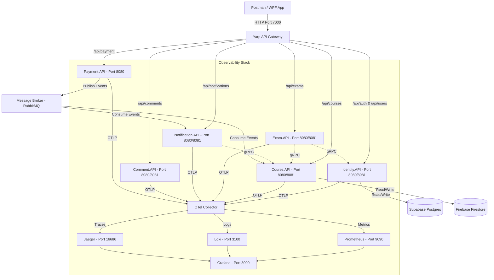

# Hướng Dẫn Kiểm Thử Toàn Bộ Hệ Thống Bằng Postman & Observability

Tài liệu này hướng dẫn chi tiết cách thực hiện kiểm thử toàn bộ hệ thống Microservices **SmartEdu** thông qua API Gateway (Yarp) bằng **Postman**, kết hợp giám sát trạng thái hệ thống, phân tích hiệu năng và trace lỗi thông qua bộ công cụ **Observability** (Jaeger, Prometheus, Loki, Grafana, OpenTelemetry Collector).

---

## 1. Tổng Quan Kiến Trúc Hệ Thống & Kiểm Thử

Hệ thống SmartEdu được xây dựng trên kiến trúc Microservices sử dụng **.NET 9** và các dịch vụ bổ trợ:



### Các Dịch Vụ và Cổng Kết Nối Trong Docker-Compose
* **Yarp API Gateway**: `http://localhost:7000` (Điểm đầu nhận mọi request từ Client)
* **RabbitMQ Management**: `http://localhost:15672` (guest / guest)
* **Jaeger Tracing**: `http://localhost:16686`
* **Prometheus**: `http://localhost:9090`
* **Loki Log Aggregator**: `http://localhost:3100`
* **Grafana Dashboard**: `http://localhost:3000` (admin / admin)
* **Redis**: `localhost:6379` (Caching & Distributed Session)

---

## 2. Hướng Dẫn Cấu Hình Và Sử Dụng Postman

Hệ thống đã tự động tạo sẵn một file Postman Collection hoàn chỉnh có tên là `SmartEdu.postman_collection.json` nằm tại thư mục gốc của project. Bạn chỉ cần import vào Postman để sử dụng ngay lập tức.

### 2.1. Cách Import Collection Vào Postman
1. Mở phần mềm **Postman**.
2. Chọn nút **Import** ở góc trên cùng bên trái.
3. Kéo và thả file [SmartEdu.postman_collection.json](file:///c:/Users/dinhq/source/repos/SE361_Microservices/SmartEdu.postman_collection.json) vào vùng import hoặc chọn file từ máy tính.
4. Nhấn **Import** để hoàn tất.

### 2.2. Biến Môi Trường (Collection Variables)
Bộ collection đi kèm với các biến được định nghĩa sẵn. Bạn có thể xem và cập nhật chúng bằng cách click vào tên Collection ở thanh bên trái, sau đó chọn tab **Variables**:

| Tên biến | Giá trị mặc định | Mô tả |
| :--- | :--- | :--- |
| `baseUrl` | `http://localhost:7000` | URL của Yarp API Gateway định tuyến đến các service |
| `token` | *Tự động cập nhật* | Token JWT của người dùng hiện tại |
| `userId` | *Tự động cập nhật* | ID của User đăng nhập (lấy từ Supabase / Identity) |
| `courseId` | *Tự động cập nhật* | ID của Khóa học vừa được tạo (lấy từ Firestore) |
| `lessonId` | *Tự động cập nhật* | ID của Bài học vừa được tạo |
| `asmId` | *Tự động cập nhật* | ID của Bài tập vừa được tạo |
| `examId` | *Tự động cập nhật* | ID của Bài kiểm tra trắc nghiệm vừa được tạo |
| `commentId` | *Tự động cập nhật* | ID của Bình luận vừa tạo |
| `notificationId` | *Tự động cập nhật* | ID của Thông báo gần nhất nhận được |
| `transactionId` | *Tự động cập nhật* | Mã Correlation ID dùng để tracking luồng giao dịch thanh toán |

### 2.3. Cơ Chế Tự Động Hóa Trích Xuất Token & ID
Để việc kiểm thử diễn ra trơn tru mà không cần sao chép thủ công các ID và Token, các request đăng nhập và tạo mới tài nguyên đều chứa **Post-response Scripts** (trước đây là Tests script) để tự động lưu thông tin vào các biến.

*Ví dụ Script tự động lưu JWT Token sau khi Đăng Nhập:*
```javascript
var jsonData = pm.response.json();
if (jsonData.token) {
    pm.collectionVariables.set("token", jsonData.token);
    pm.collectionVariables.set("userId", jsonData.uid || "");
}
```

*Ví dụ Script tự động lưu Course ID sau khi tạo Khóa học:*
```javascript
var jsonData = pm.response.json();
if (jsonData.Id) {
    pm.collectionVariables.set("courseId", jsonData.Id);
}
```

### 2.4. Kế Thừa Quyền (Authorization Inheritance)
Tất cả các thư mục con trong Collection (như *Course Service*, *Exam Service*, *Notification Service*, v.v.) được thiết lập sử dụng cơ chế kế thừa quyền **Bearer Token** từ thư mục cha. 
* Do đó, khi bạn chạy request Đăng nhập (Student hoặc Instructor), biến `token` sẽ tự động cập nhật và các request khác sẽ tự động đính kèm Token này vào Header mà bạn không cần cấu hình thêm.

---

## 3. Kịch Bản Kiểm Thử End-to-End (E2E)

Hãy chạy các request theo thứ tự logic dưới đây để giả lập một vòng đời hoàn chỉnh của hệ thống E-Learning:

### Bước 1: Khởi Tạo Người Dùng, Cấp Quyền Giáo Viên & Đăng Nhập
> [!IMPORTANT]
> Mọi tài khoản khi đăng ký mặc định sẽ có quyền `Student`. Để thực hiện chức năng của Giáo viên (Tạo khóa học, bài học...), bạn bắt buộc phải đăng nhập bằng tài khoản Admin để cấp quyền `Instructor` cho tài khoản giáo viên vừa tạo. Nếu không, bạn sẽ nhận lỗi `403 Forbidden` khi tạo khóa học.

1. Chạy request **1. Đăng ký Học sinh** để tạo tài khoản học sinh (`student_test@gmail.com`). (Lưu `userId`).
2. Chạy request **2. Đăng ký Giáo viên** để tạo tài khoản giáo viên (`instructor_test@gmail.com`). (Lưu `instructorId`).
3. Chạy request **3. Đăng nhập Admin (Lấy Token Admin)** sử dụng tài khoản hệ thống mặc định (`admin` / `admin`).
4. Chạy request **4. Cấp quyền Giáo viên (Dùng Token Admin)** để nâng cấp tài khoản `instructor_test@gmail.com` lên vai trò `Instructor` trong database.
5. Chạy request **5. Đăng nhập Giáo viên (Lấy Token)** để cập nhật Token JWT mới có chứa Role `Instructor`. Token này sẽ tự động lưu lại vào biến `token`.

### Bước 2: Giáo Viên Tạo Khóa Học & Nội Dung
1. Chạy request **2. Tạo khóa học mới (Giáo viên)** để tạo khóa học trắc nghiệm và thực hành Microservices. Lúc này hệ thống sẽ trả về thành công vì tài khoản đã được cấp quyền `Instructor`. (Biến `courseId` sẽ được tự động lưu).
2. Chạy request **5. Thêm bài học mới** để tạo bài học đầu tiên (Lưu `lessonId`).
3. Chạy request **8. Thêm nội dung tài liệu khóa học** để đính kèm slide bài giảng cho bài học.
4. Chạy request **1. Tạo bài tập mới (Giáo viên)** trong thư mục *Assignment* để thêm một bài nộp thực hành (Lưu `asmId`).

### Bước 3: Đăng Nhập Học Sinh & Đăng Ký Khóa Học
1. Chạy request **6. Đăng nhập Học sinh (Lấy Token)** để chuyển sang phiên làm việc của Học sinh. (Token học sinh được cập nhật).
2. Chạy request **12. Học sinh đăng ký khóa học** để gửi yêu cầu đăng ký học khóa học hiện tại (Trạng thái đăng ký mặc định là `Pending`).
3. Chạy request **13. Xem danh sách khóa học tôi đã đăng ký** để kiểm tra trạng thái khóa học hiện tại.

### Bước 4: Giáo Viên Duyệt Học Sinh
1. Chạy request **5. Đăng nhập Giáo viên (Lấy Token)** để quay lại phiên làm việc của Giáo viên.
2. Chạy request **14. Xem danh sách học sinh của khóa học** để tìm ID đăng ký học (`regId`).
3. Sao chép `regId` kết quả và dán đè lên chữ `someRegId` trong đường dẫn URL của request **15. Phê duyệt học sinh vào lớp (Giáo viên)**, sau đó nhấn **Send** để chấp nhận học sinh vào lớp học.

### Bước 5: Thực Hiện Thanh Toán Học Phí (Payment Flow)
SmartEdu hỗ trợ cả cổng thanh toán nội địa VNPay Sandbox lẫn cổng quốc tế PayPal Sandbox:
1. Chạy lại request **6. Đăng nhập Học sinh (Lấy Token)** để đóng vai Học sinh.
2. **Đối với VNPay:**
   * Chạy request **1. Khởi tạo thanh toán VNPay Sandbox**. Phản hồi sẽ trả về một `paymentUrl` và tự động lưu `transactionId` (Correlation ID).
   * Bạn copy đường dẫn `paymentUrl` dán vào trình duyệt web và sử dụng thông tin thẻ kiểm thử dưới đây để hoàn tất thanh toán:
     * **Ngân hàng:** NCB
     * **Số thẻ:** `9704198526191432198`
     * **Tên chủ thẻ:** `NGUYEN VAN A`
     * **Ngày phát hành:** `07/15`
     * **Mật khẩu OTP:** `123456`
3. **Đối với Webhook (Giả lập khi chạy offline / CI-CD):**
   * Nếu bạn chạy cục bộ và không thể kết nối Internet để cổng thanh toán redirect về localhost, hãy chạy request **3. Giả lập VNPay Webhook (Thanh toán thành công)** hoặc **4. Giả lập PayPal Webhook**.
   * Việc gọi Webhook này sẽ kích hoạt `PaymentCompletedEvent` đẩy lên RabbitMQ để tự động đăng ký học viên thành công và gửi thông báo.

### Bước 6: Làm Bài Tập, Thảo Luận & Làm Bài Kiểm Tra
1. **Nộp bài tập:** Học sinh chạy request **5. Nộp bài tập (Học sinh)** để gửi link Github bài làm.
2. **Chấm điểm:** Giáo viên đăng nhập lại và chấm điểm bằng request **7. Chấm điểm bài nộp (Giáo viên)**. Sau đó công bố điểm bằng request **8. Công bố điểm**.
3. **Bình luận:** Học sinh chạy request **1. Thêm bình luận vào bài học** để hỏi bài (Lưu `commentId`).
4. **Kiểm tra trắc nghiệm:**
   * Giáo viên tạo đề thi trắc nghiệm bằng cách chạy request **1. Tạo đề thi trắc nghiệm (Giáo viên)** trong thư mục *Exam Service* (Lưu `examId`).
   * Học sinh chạy request **4. Lấy câu hỏi đề thi (Học sinh bắt đầu thi)** để tải các câu hỏi thi về máy.
   * Học sinh gửi phản hồi qua request **6. Nộp bài thi trắc nghiệm (Học sinh)** để tính điểm tự động.

---

## 4. Hướng Dẫn Sử Dụng Bộ Công Cụ Observability

Hệ thống SmartEdu được tích hợp sâu kiến trúc **OpenTelemetry (OTel)**. Khi bạn thực hiện các request trên Postman, hệ thống sẽ tự động sinh ra traces, metrics và logs để theo dõi.

### 4.1. Distributed Tracing với Jaeger (`http://localhost:16686`)
Jaeger thu nhận thông tin Span từ tất cả microservices và liên kết chúng lại thành một biểu đồ dạng cây thời gian để đo đếm latency và tìm điểm nghẽn.

#### Cách Tìm Kiếm Traces Trong Jaeger:
1. Mở trình duyệt truy cập `http://localhost:16686`.
2. Tại khung **Search** bên trái:
   * **Service**: Chọn dịch vụ mong muốn, ví dụ: `yarpapigateway` để xem vết đi vào từ Gateway, hoặc `Payment.API` để xem giao dịch.
   * **Operation**: Chọn endpoint API cụ thể (ví dụ: `POST api/payment/create`).
3. Bấm **Find Traces**. Click vào một trace cụ thể để xem chi tiết.

#### Phân Tích Luồng Phân Tán (Event-Driven Tracing):
Khi bạn thực hiện tạo một giao dịch thanh toán thành công thông qua Webhook, Jaeger sẽ hiển thị một Trace bao quát chạy qua nhiều tiến trình khác nhau:

```
[yarpapigateway] POST /api/payment/webhook/VNPay
 └── [Payment.API] Webhook Method Processed
      ├── [Payment.API] Save Transaction to Database (Npgsql Postgres)
      ├── [Payment.API] Publish PaymentCompletedEvent (MassTransit Publish)
      │    └── [RabbitMQ] Delivery to Exchange
      │         ├── [Course.API] Consume PaymentCompletedEvent (MassTransit Consume)
      │         │    └── [Course.API] Enroll Student in Firestore (Google Firestore Write)
      │         └── [Notification.API] Consume PaymentCompletedEvent
      │              └── [Notification.API] Create Firestore Notification Log
```

> [!NOTE]
> Việc trace được cả luồng Message Broker không đồng bộ (RabbitMQ) và gRPC đồng bộ giữa các dịch vụ giúp lập trình viên xác định chính xác dịch vụ nào đang xử lý chậm hoặc bị lỗi kết nối dữ liệu.

---

### 4.2. Log Tập Trung Với Grafana Loki (`http://localhost:3000`)
Tất cả các log ghi nhận bởi thư viện Serilog / OpenTelemetry Logger của các service sẽ được gom tụ về Loki, cho phép bạn truy vấn log real-time kết hợp bộ lọc cực mạnh.

#### Cách Truy Vấn Log Trong Grafana:
1. Truy cập `http://localhost:3000` (Tài khoản: `admin` / Mật khẩu: `admin`).
2. Nhấp vào biểu tượng Menu bên trái -> chọn **Explore**.
3. Ở góc trên bên trái, đổi Data Source sang **Loki**.
4. Sử dụng thanh truy vấn **LogQL** để lọc log:
   * Tìm tất cả log của dịch vụ Identity:
     ```logql
     {otel_resource_service_name="Identity.API"}
     ```
   * Tìm các log lỗi hoặc cảnh báo:
     ```logql
     {otel_resource_service_name="Course.API"} |~ "Error" or "Exception"
     ```
   * Tìm tất cả log liên quan đến một request cụ thể bằng mã Trace ID (được trích xuất từ Jaeger hoặc Header phản hồi):
     ```logql
     {otel_resource_service_name=~".+"} |~ "your-trace-id-here"
     ```

---

### 4.3. Giám Sát Metrics Với Prometheus & Grafana
Các chỉ số tài nguyên hệ thống, số lượng request, tỉ lệ lỗi HTTP 5xx, và thời gian phản hồi trung bình được Prometheus thu thập định kỳ mỗi 15 giây từ OpenTelemetry Collector.

#### Cách Kiểm Tra Trực Tiếp Trong Prometheus (`http://localhost:9090`):
1. Truy cập `http://localhost:9090`.
2. Trong ô tìm kiếm metric, gõ tên metric của .NET core như:
   * `http_server_request_duration_seconds_bucket` (Xem phân bổ thời gian phản hồi HTTP)
   * `process_cpu_utilization` (Tỷ lệ sử dụng CPU của tiến trình)
   * `process_memory_working_set` (Lượng bộ nhớ RAM đang sử dụng)
3. Nhấn **Execute** và chọn tab **Graph** để xem biểu đồ trực quan.

#### Cách Xem Dashboard Trực Quan Trong Grafana:
1. Mở **Grafana** (`http://localhost:3000`).
2. Vào **Dashboards** -> Chọn **New** -> **Import**.
3. Bạn có thể nhập ID của dashboard ASP.NET Core có sẵn trên thư viện Grafana (ví dụ Dashboard ID: **17143** hoặc **19827** cho OpenTelemetry .NET Metrics).
4. Chọn data source là **Prometheus** và hoàn tất import để có biểu đồ dashboard đẹp mắt theo dõi CPU, RAM, Thread Pool, và lưu lượng HTTP Requests.

---

## 5. Hướng Dẫn Tìm Lỗi (Troubleshooting & Debugging)

Khi kiểm thử các API trên Postman và gặp mã lỗi không mong muốn (ví dụ `500 Internal Server Error` hoặc `403 Forbidden`), hãy áp dụng quy trình kiểm lỗi 3 bước sau:

1. **Tìm Trace ID:**
   * Kiểm tra phần phản hồi Header trên Postman của request bị lỗi để tìm mã `traceparent` hoặc kiểm tra log console của Yarp Gateway để lấy mã Trace ID.
2. **Tra Cứu Trên Jaeger:**
   * Mở Jaeger, dán Trace ID vào thanh tìm kiếm ở góc trên bên phải. Bạn sẽ thấy biểu đồ luồng request. Nút nào màu đỏ biểu thị service đó bị crash. Click vào node đỏ để xem thông báo biệt lệ (Exception Details) và Stack Trace.
3. **Phân Tích Log Đồng Thời Trên Loki:**
   * Trong Grafana Explore Loki, tìm kiếm theo Trace ID để đọc các thông tin log debug xung quanh thời điểm phát sinh lỗi để có thêm ngữ cảnh (Ví dụ: Chuỗi kết nối DB lỗi, Hết hạn token, Firebase sai credentials cấu hình, v.v.).

---

**Chúc bạn kiểm thử thành công hệ thống SmartEdu!**
