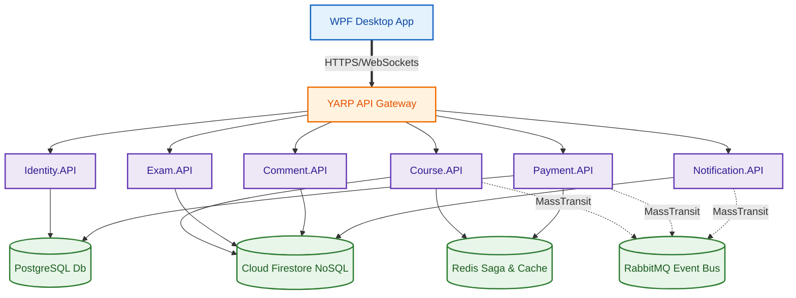
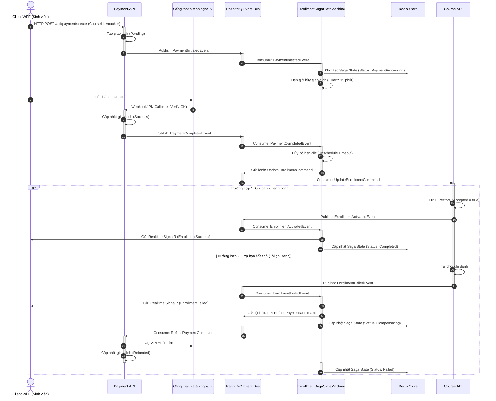
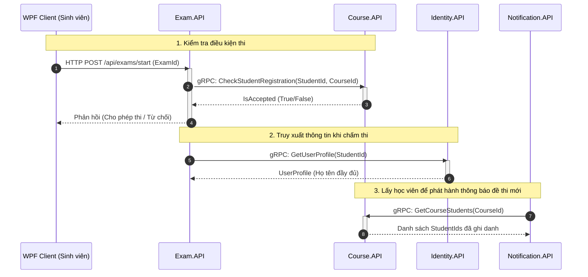
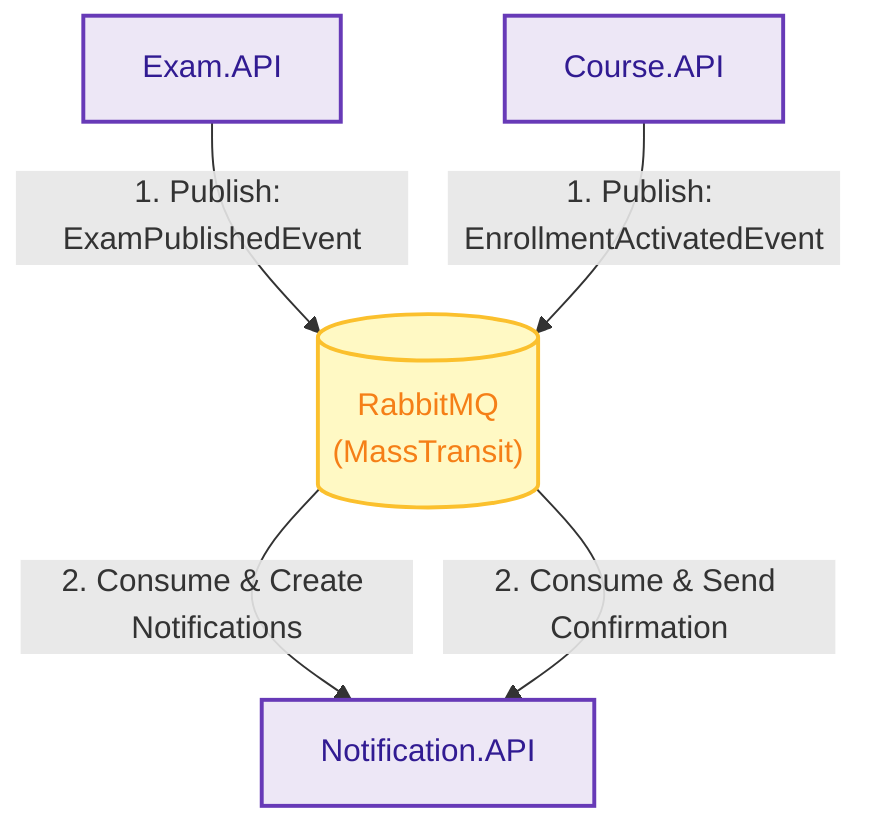
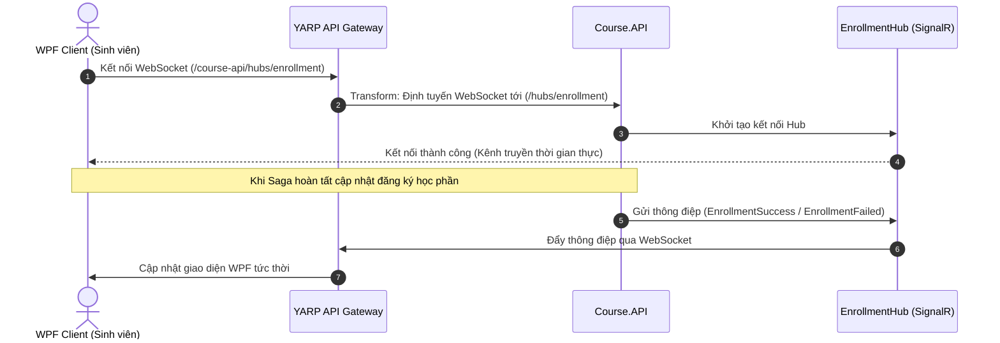
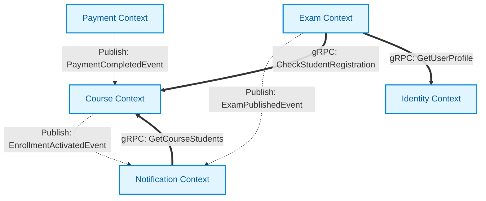
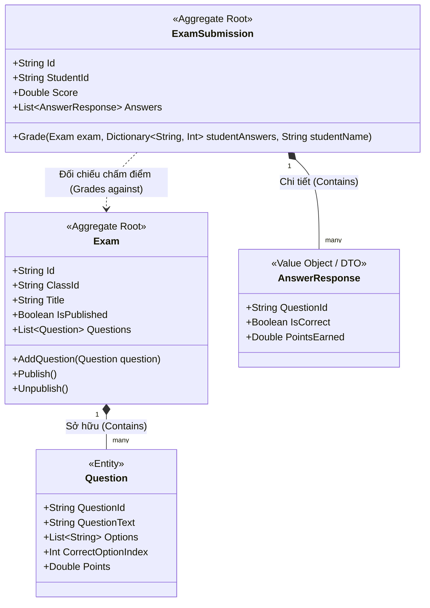

# BÁO CÁO PHÂN TÍCH CHI TIẾT KIẾN TRÚC SMARTEDU MICROSERVICES

Hệ thống **SmartEdu** sử dụng kiến trúc **Microservices** phân tán trên nền tảng **.NET 9**, tích hợp truyền thông hướng sự kiện (Event-Driven Architecture), các cơ chế giao tiếp đồng bộ hiệu năng cao (gRPC) và đẩy dữ liệu thời gian thực (SignalR). Tài liệu này phân tích chi tiết cấu trúc API Gateway, hệ thống Building Blocks và 6 phân hệ (Microservices) nghiệp vụ của hệ thống.

---

## MỤC LỤC

1. [Tổng Quan Kiến Trúc Hệ Thống](#1-tổng-quan-kiến-trúc-hệ-thống)
2. [Phân Tích Chi Tiết API Gateway (YarpApiGateway)](#2-phân-tích-chi-tiết-api-gateway-yarpapigateway)
3. [Phân Tích Chi Tiết Building Blocks](#3-phân-tích-chi-tiết-building-blocks)
4. [Phân Tích Chi Tiết 6 Modules Nghiệp Vụ](#4-phân-tích-chi-tiết-6-modules-nghiệp-vụ)
5. [Phân Tích Luồng Hoạt Động Của Saga State Machine](#5-phân-tích-luồng-hoạt-động-của-saga-state-machine)
6. [Các Luồng Giao Tiếp Khác (gRPC, Event-Driven & SignalR)](#6-các-luồng-giao-tiếp-khác-grpc-event-driven--signalr)

---

## 1. TỔNG QUAN KIẾN TRÚC HỆ THỐNG

SmartEdu chuyển dịch từ mô hình nguyên khối sang kiến trúc Microservices tách biệt với nguyên lý **Database-per-Service**. Hệ thống bao gồm các thành phần:
*   **Client Layer**: WPF Desktop Application kết nối qua API Gateway.
*   **Gateway Layer**: YARP API Gateway làm điểm đầu mối định tuyến duy nhất.
*   **Service Layer**: 6 Microservices nghiệp vụ chạy độc lập, tự chủ về dữ liệu.
*   **Integration Layer**: RabbitMQ (MassTransit) làm Message Broker truyền tải sự kiện và Redis làm kho lưu trữ trạng thái Saga.
*   **Observability Subsystem**: OpenTelemetry và Jaeger hỗ trợ truy vết phân tán (Distributed Tracing).

---

## 2. PHÂN TÍCH CHI TIẾT API GATEWAY ([YarpApiGateway](file:///d:/NHA/SE361_Microservices/ApiGateways/YarpApiGateway))

API Gateway đóng vai trò làm lá chắn bảo vệ và định tuyến các yêu cầu từ phía Client tới các service thích hợp.

### Cấu hình định tuyến (Routing) trong [appsettings.json](file:///d:/NHA/SE361_Microservices/ApiGateways/YarpApiGateway/appsettings.json)
Gateway quản lý một danh sách ánh xạ các Route tới các Cluster cụ thể:
*   **Xác thực & Tài khoản**: `/api/auth/{**catch-all}` và `/api/users/{**catch-all}` định tuyến sang `identity-cluster` (`http://identity.api:8080`).
*   **Khóa học**: `/api/courses/{**catch-all}` định tuyến sang `course-cluster` (`http://course.api:8080`).
*   **Thi trực tuyến**: `/api/exams/{**catch-all}` định tuyến sang `exam-cluster` (`http://exam.api:8080`).
*   **Thông báo**: `/api/notifications/{**catch-all}` định tuyến sang `notification-cluster` (`http://notification.api:8080`).
*   **Thảo luận/Bình luận**: `/api/comments/{**catch-all}` định tuyến sang `comment-cluster` (`http://comment.api:8080`).
*   **Thanh toán**: `/api/payment/{**catch-all}` định tuyến sang `payment-cluster` (`http://payment.api:8080`).
*   **Kết nối SignalR Hub**: `/course-api/hubs/{**catch-all}` định tuyến đến `course-cluster` đồng thời áp dụng Transform thay đổi đường dẫn URL đích thành `/hubs/{**catch-all}` để định tuyến thông suốt kết nối WebSocket.

### Các chính sách cốt lõi trong [Program.cs](file:///d:/NHA/SE361_Microservices/ApiGateways/YarpApiGateway/Program.cs)
*   **Rate Limiting (api-limiter)**: Áp dụng thuật toán Fixed Window. Mỗi địa chỉ IP hoặc định danh chỉ được phép thực hiện tối đa **100 requests trong vòng 10 giây**. Hàng đợi yêu cầu cho phép tối đa **10 requests** xử lý theo nguyên tắc cũ trước (`OldestFirst`). Nếu vượt ngưỡng, hệ thống từ chối bằng lỗi `429 Too Many Requests`.
*   **WebSockets**: Bật `app.UseWebSockets()` để hỗ trợ các kết nối SignalR thời gian thực qua giao thức WebSocket từ WPF Client tới các Hub phía sau.
*   **OpenTelemetry Tracing**: Tích hợp thu thập log vết thực thi (Tracing) tự động cho toàn bộ các request đi ngang qua Gateway.

---

## 3. PHÂN TÍCH CHI TIẾT BUILDING BLOCKS ([BuildingBlocks](file:///d:/NHA/SE361_Microservices/BuildingBlocks))

Hệ thống thiết lập 2 khối Building Blocks dùng chung để tránh trùng lặp mã nguồn và thống nhất thiết kế hệ thống.

### A. Khối dùng chung Common ([BuildingBlocks](file:///d:/NHA/SE361_Microservices/BuildingBlocks/BuildingBlocks))
*   **Behaviors (MediatR Pipeline)**:
    *   [ValidationBehavior.cs](file:///d:/NHA/SE361_Microservices/BuildingBlocks/BuildingBlocks/Behaviors/ValidationBehavior.cs): Tự động chặn toàn bộ các Command/Query trước khi đến Handler để kiểm tra lỗi nghiệp vụ/dữ liệu bằng thư viện `FluentValidation`. Nếu dữ liệu không hợp lệ, hệ thống sẽ ném ra lỗi validation ngay lập tức.
    *   [LoggingBehavior.cs](file:///d:/NHA/SE361_Microservices/BuildingBlocks/BuildingBlocks/Behaviors/LoggingBehavior.cs): Tự động ghi lại thời gian bắt đầu, kết thúc và nội dung của các Command/Query giúp giám sát hiệu năng và hỗ trợ debug.
*   **CQRS**: Định nghĩa các Interface nền tảng để triển khai mô hình CQRS:
    *   `ICommand<TResponse>` & `ICommandHandler<TCommand, TResponse>`
    *   `IQuery<TResponse>` & `IQueryHandler<IQuery, TResponse>`
*   **Exceptions & Global Handling**:
    *   Định nghĩa các lỗi nghiệp vụ chuẩn như `NotFoundException`, `BadRequestException`, `InternalServerException`.
    *   [CustomExceptionHandler.cs](file:///d:/NHA/SE361_Microservices/BuildingBlocks/BuildingBlocks/Exceptions/Handler/CustomExceptionHandler.cs): Đăng ký vào middleware của ASP.NET Core để bắt mọi Exception chưa được xử lý và xuất ra tài liệu JSON chuẩn `ProblemDetails` (RFC 7807).
*   **Diagnostics**: [OpenTelemetryExtensions.cs](file:///d:/NHA/SE361_Microservices/BuildingBlocks/BuildingBlocks/Diagnostics/OpenTelemetryExtensions.cs) tự động đăng ký các nguồn phát Tracing, Metrics gửi về Jaeger Collector.
*   **HealthChecks**: [FirestoreHealthCheck.cs](file:///d:/NHA/SE361_Microservices/BuildingBlocks/BuildingBlocks/HealthChecks/FirestoreHealthCheck.cs) dùng để tự động ping kiểm tra kết nối với Cloud Firestore định kỳ.
*   **Helpers**: [FirestoreTimestampConverter.cs](file:///d:/NHA/SE361_Microservices/BuildingBlocks/BuildingBlocks/Helpers/FirestoreTimestampConverter.cs) giúp chuyển đổi định dạng Timestamp của Firestore sang kiểu `DateTime` trong C# khi tuần tự hóa JSON.

### B. Khối truyền tin Event Bus ([BuildingBlocks.Messaging](file:///d:/NHA/SE361_Microservices/BuildingBlocks/BuildingBlocks.Messaging))
*   **Commands (Chỉ dẫn thay đổi trạng thái)**:
    *   `UpdateEnrollmentCommand`: Ra lệnh cho Course.API cập nhật ghi danh học viên.
    *   `RefundPaymentCommand`: Ra lệnh cho Payment.API thực hiện hoàn lại tiền (Compensating Transaction).
*   **Events (Sự kiện tích hợp)**: 
    *   Bộ sự kiện thanh toán: `PaymentInitiatedEvent`, `PaymentCompletedEvent`, `PaymentFailedEvent`.
    *   Bộ sự kiện ghi danh: `EnrollmentActivatedEvent`, `EnrollmentFailedEvent`.
    *   Bộ sự kiện học tập: `ExamPublishedEvent`, `CoursePurchasedEvent`.
*   **MassTransit Extensions**: [Extensions.cs](file:///d:/NHA/SE361_Microservices/BuildingBlocks/BuildingBlocks.Messaging/MassTransit/Extensions.cs) cung cấp phương thức khởi tạo MassTransit với RabbitMQ tự động cấu hình các Consumer từ một Assembly cụ thể, thiết lập định dạng hàng đợi theo Kebab-case, và cài đặt Quartz Scheduler để lập lịch cho các Event có độ trễ (Delay).

---

## 4. PHÂN TÍCH CHI TIẾT 6 MODULES NGHIỆP VỤ

### Module 1: Identity.API ([Identity.API](file:///d:/NHA/SE361_Microservices/Services/Identity/Identity.API))
*   **Cơ sở dữ liệu**: PostgreSQL (Supabase Cloud). Áp dụng Entity Framework Core Migrations tự động ở hàm khởi tạo.
*   **Chức năng chính**:
    *   Quản lý danh sách người dùng, hồ sơ, ảnh đại diện.
    *   Đăng ký tài khoản, đăng nhập JWT, hỗ trợ xác thực OAuth2 Google.
    *   [SyncUserHandler.cs](file:///d:/NHA/SE361_Microservices/Services/Identity/Identity.API/Features/Users/SyncUser/SyncUserHandler.cs): Tiếp nhận thông tin từ WPF Client sau khi đăng nhập thành công qua Firebase Auth bên phía Client để đồng bộ các thuộc tính tài khoản (Email, Tên, Ảnh) vào cơ sở dữ liệu PostgreSQL của hệ thống backend.
*   **gRPC Server**: [UserGrpcService.cs](file:///d:/NHA/SE361_Microservices/Services/Identity/Identity.API/Services/UserGrpcService.cs) cung cấp hàm `GetUserProfile` để dịch vụ khác lấy thông tin hồ sơ của học viên qua kết nối mạng nội bộ.

### Module 2: Course.API ([Course.API](file:///d:/NHA/SE361_Microservices/Services/Course/Course.API))
*   **Cơ sở dữ liệu**: Google Cloud Firestore NoSQL.
*   **Chức năng chính**:
    *   Quản lý cấu trúc khóa học, bài học (Lessons), bài tập về nhà (Assignments), tài liệu.
    *   Tiếp nhận ghi danh và quản lý danh sách học viên lớp học.
*   **Saga State Machine**: Chứa [EnrollmentStateMachine.cs](file:///d:/NHA/SE361_Microservices/Services/Course/Course.API/Features/Registrations/Sagas/EnrollmentStateMachine.cs) sử dụng Redis Saga Repository lưu trữ trạng thái giao dịch đăng ký học và thanh toán học phí.
*   **SignalR Push**: Khởi tạo [EnrollmentHub](file:///d:/NHA/SE361_Microservices/Services/Course/Course.API/Hubs) để đẩy thông tin thành công hay thất bại tức thời cho Client.
*   **gRPC Server**: [CourseGrpcService.cs](file:///d:/NHA/SE361_Microservices/Services/Course/Course.API/Services/CourseGrpcService.cs) cung cấp kiểm tra đăng ký lớp (`CheckStudentRegistration`), lấy danh sách học viên (`GetCourseStudents`), v.v.

### Module 3: Exam.API ([Exam.API](file:///d:/NHA/SE361_Microservices/Services/Exam/Exam.API))
*   **Kiến trúc**: Sử dụng **Clean Architecture** (tách biệt Domain, Application, Infrastructure và Presentation).
*   **Cơ sở dữ liệu**: Google Cloud Firestore (Lưu trữ đề thi, ngân hàng câu hỏi, lịch sử và kết quả bài làm).
*   **Chức năng chính**:
    *   Tạo đề thi trắc nghiệm, thiết lập cấu hình thời gian thi, điểm đạt và số lần thi tối đa.
    *   Chấm điểm bài làm tự động, lưu trữ lịch sử thi và trả về đáp án kèm lời giải chi tiết.
    *   Đăng sự kiện `ExamPublishedEvent` khi đề thi được giảng viên phát hành.
*   **gRPC Clients**: Liên kết gRPC với [CourseServiceClient.cs](file:///d:/NHA/SE361_Microservices/Services/Exam/Exam.Infrastructure/Services/CourseServiceClient.cs) và [UserServiceClient.cs](file:///d:/NHA/SE361_Microservices/Services/Exam/Exam.Infrastructure/Services/UserServiceClient.cs) để kiểm tra trạng thái học viên và họ tên đầy đủ trước khi cho phép vào thi.

### Module 4: Payment.API ([Payment.API](file:///d:/NHA/SE361_Microservices/Services/Payment/Payment.API))
*   **Cơ sở dữ liệu**: PostgreSQL (Lưu lịch sử giao dịch thanh toán và thông tin mã giảm giá Voucher).
*   **Chức năng chính**:
    *   Khởi tạo đơn thanh toán, tính toán tiền sau giảm giá từ Voucher, lưu giao dịch trạng thái `Pending` và phát sự kiện `PaymentInitiatedEvent`.
    *   Cung cấp URL thanh toán của VNPay, MoMo, PayPal.
    *   Tiếp nhận Webhook/IPN xử lý chữ ký số của VNPay, MoMo và PayPal.
    *   [RefundPaymentConsumer.cs](file:///d:/NHA/SE361_Microservices/Services/Payment/Payment.API/EventBusConsumer/RefundPaymentConsumer.cs): Lắng nghe lệnh từ Saga để tự động kích hoạt tiến trình hoàn tiền qua API của nhà cung cấp cổng thanh toán nếu xảy ra lỗi ghi danh.

### Module 5: Notification.API ([Notification.API](file:///d:/NHA/SE361_Microservices/Services/Notification/Notification.API))
*   **Cơ sở dữ liệu**: Google Cloud Firestore (Lưu trữ thông báo cá nhân).
*   **Chức năng chính**: Gửi Email và đẩy thông báo thời gian thực.
*   **Consumers**:
    *   [ExamPublishedConsumer.cs](file:///d:/NHA/SE361_Microservices/Services/Notification/Notification.API/Consumers/ExamPublishedConsumer.cs): Tiêu thụ `ExamPublishedEvent`, gọi gRPC sang Course.API lấy danh sách học viên đã ghi danh thành công và chèn thông báo bài kiểm tra mới cho từng học viên.
    *   [EnrollmentActivatedConsumer.cs](file:///d:/NHA/SE361_Microservices/Services/Notification/Notification.API/EventBusConsumer/EnrollmentActivatedConsumer.cs): Tiêu thụ `EnrollmentActivatedEvent` để tạo thông báo xác nhận đã thanh toán thành công khóa học.

### Module 6: Comment.API ([Comment.API](file:///d:/NHA/SE361_Microservices/Services/Comment/Comment.API))
*   **Cơ sở dữ liệu**: Google Cloud Firestore.
*   **Chức năng chính**: Quản lý bình luận, trao đổi thảo luận của sinh viên dưới mỗi bài học. Module này được thiết kế tối giản, tách biệt hoàn toàn để khi có lượng tương tác bình luận thảo luận cực lớn cũng không làm ảnh hưởng đến hiệu năng của các tác vụ quan trọng như thi cử và thanh toán học phí.

---

## 5. PHÂN TÍCH LUỒNG HOẠT ĐỘNG CỦA SAGA STATE MACHINE

Saga chịu trách nhiệm duy trì tính toàn vẹn dữ liệu cho tiến trình đăng ký và thanh toán khóa học. Luồng hoạt động chi tiết được thể hiện qua sơ đồ tuần tự dưới đây:

---

## 6. CÁC LUỒNG GIAO TIẾP KHÁC (gRPC, EVENT-DRIVEN & SIGNALR)

### A. Luồng giao tiếp đồng bộ trực tiếp qua gRPC
Để giảm thiểu độ trễ, nâng cao tốc độ tải và đảm bảo an toàn mạng nội bộ, hệ thống sử dụng gRPC:
*   **Kiểm tra điều kiện thi**: WPF Client gửi yêu cầu thi tới `Exam.API` $\rightarrow$ `Exam.API` thực hiện cuộc gọi gRPC `CheckStudentRegistration` sang `Course.API` $\rightarrow$ `Course.API` kiểm tra nhanh trên Firestore và trả về kết quả `IsAccepted` nhị phân cực nhanh.
*   **Truy xuất thông tin hiển thị**: `Exam.API` gọi gRPC `GetUserProfile` sang `Identity.API` để hiển thị họ tên của học sinh khi chấm thi.
*   **Phát hành thông báo**: `Notification.API` gọi gRPC `GetCourseStudents` sang `Course.API` lấy danh sách học viên của một lớp để tạo thông báo đồng loạt khi phát hành đề thi mới.

### B. Luồng giao tiếp bất đồng bộ hướng sự kiện (RabbitMQ)
Giúp giảm tải hệ thống bằng cách thực hiện các tác vụ tốn thời gian ở chế độ nền (Background) mà không bắt Client phải đứng chờ phản hồi:
*   **Tạo thông báo thi**: `Exam.API` chỉ cần phát sự kiện `ExamPublishedEvent` lên Broker rồi trả về HTTP 200 OK ngay lập tức cho Giảng viên. Tiến trình tạo và lưu thông báo cho từng sinh viên được `Notification.API` xử lý bất đồng bộ sau đó.
*   **Ghi nhận thông báo thanh toán**: Sự kiện `EnrollmentActivatedEvent` được xuất bản bởi Course.API sau khi cập nhật thành công sẽ kích hoạt Consumer trong `Notification.API` tự động tạo thông báo xác nhận giao dịch.

### C. Luồng truyền tin thời gian thực qua WebSockets (SignalR)
Khắc phục nhược điểm kéo dữ liệu liên tục (Polling) gây lãng phí tài nguyên:
*   WPF Client kết nối vào Gateway thông qua proxy WebSocket.
*   Khi có bất kỳ thay đổi quan trọng nào trong tiến trình thanh toán/ghi danh (được điều phối bởi Saga), Saga State Machine trực tiếp gọi SignalR Hub để đẩy thông báo (`EnrollmentSuccess` hoặc `EnrollmentFailed`) đến đúng kết nối của học sinh. Màn hình WPF Client sẽ lập tức hiển thị thông báo hoặc tự động chuyển tiếp giao diện mà không cần người dùng thao tác.

---

## 7. ÁP DỤNG THIẾT KẾ HƯỚNG TÊN MIỀN (DOMAIN-DRIVEN DESIGN - DDD)

Hệ thống **SmartEdu** áp dụng linh hoạt cả **DDD chiến lược (Strategic DDD)** để phân chia ranh giới dịch vụ và **DDD chiến thuật (Tactical DDD)** để xây dựng mô hình nghiệp vụ có tính cô lập và khả năng bảo trì cao.

### A. DDD Chiến lược (Strategic DDD)

Để quản lý độ phức tạp của hệ thống lớn, SmartEdu thực hiện phân chia hệ thống thành các vùng nghiệp vụ độc lập:

1.  **Bounded Context (Ngữ cảnh giới hạn):** Mỗi Microservice là một Bounded Context riêng biệt có tính tự trị cao và sở hữu cơ sở dữ liệu riêng:
    *   **Identity Context:** Quản lý thông tin đăng nhập, phân quyền và hồ sơ cá nhân.
    *   **Course Context:** Quản lý thông tin khóa học, nội dung bài học, tiến trình học và danh sách học viên.
    *   **Exam Context:** Thiết lập ngân hàng câu hỏi, soạn đề thi trắc nghiệm và tổ chức làm bài chấm điểm.
    *   **Payment Context:** Quản lý giao dịch thanh toán trực tuyến, hoàn tiền và các chính sách mã giảm giá (Voucher).
2.  **Ubiquitous Language (Ngôn ngữ thống nhất):** Đội ngũ phát triển và chuyên gia nghiệp vụ cùng sử dụng chung một tập từ vựng chuẩn trong cả thiết kế cơ sở dữ liệu và mã nguồn (ví dụ: `Exam`, `Question`, `ExamSubmission`, `Enrollment`, `Voucher`).
3.  **Context Mapping & Integration Events:** Sự tương tác bất đồng bộ giữa các Bounded Context được kết nối thông qua Event Bus (RabbitMQ + MassTransit), đảm bảo tính nhất quán cuối cùng (Eventual Consistency):

---

### B. DDD Chiến thuật (Tactical DDD trong Exam.API)

Phân hệ `Exam.API` được tổ chức chặt chẽ theo mô hình **Clean Architecture + DDD** nhằm cô lập tối đa Core Domain nghiệp vụ:

#### 1. Sơ đồ các thành phần trong Exam Domain Aggregate
Mô hình miền của `Exam.API` được thiết kế giàu hành vi (Rich Domain Model), bao gồm các Aggregate Root quản lý tính toàn vẹn của các Entity và Value Object bên trong:

#### 2. Các thành phần Tactical cốt lõi trong Code
*   **Aggregate Root ([Exam.cs](file:///d:/NHA/SE361_Microservices/Services/Exam/Exam.Domain/Models/Exam.cs)):** 
    *   Đóng vai trò làm điểm truy cập duy nhất để thay đổi cấu trúc đề thi.
    *   Bảo vệ các ràng buộc nghiệp vụ (Invariants): Ví dụ, không được phép thêm câu hỏi sau khi đề thi đã xuất bản (`IsPublished == true`), không được xuất bản đề thi nếu không có câu hỏi nào.
*   **Entity ([Question.cs](file:///d:/NHA/SE361_Microservices/Services/Exam/Exam.Domain/Entities/Question.cs)):** 
    *   Có danh tính xác định (`QuestionId`) và có vòng đời phụ thuộc vào Aggregate `Exam`.
    *   Có constructor nghiêm ngặt tự kiểm tra dữ liệu đầu vào (tự ném ngoại lệ nếu nội dung câu hỏi trống, số lượng câu trả lời < 2, hay điểm thi bị âm).
*   **Rich Domain Behavior (Hành vi nghiệp vụ giàu thuộc tính):**
    *   Logic chấm điểm không bị phân mảnh ở Controller hay Service mà được đóng gói trực tiếp trong phương thức `Grade()` của [ExamSubmission.cs](file:///d:/NHA/SE361_Microservices/Services/Exam/Exam.Domain/Models/ExamSubmission.cs).
    *   Phương thức này tự động duyệt qua danh sách câu hỏi của bài thi gốc, so khớp đáp án của sinh viên, tự động tính tổng điểm và xếp loại kết quả.
*   **Repository Pattern ([IExamRepository.cs](file:///d:/NHA/SE361_Microservices/Services/Exam/Exam.Application/Data/IExamRepository.cs)):**
    *   Được định nghĩa tại tầng `Application` để định hình các phương thức đọc/ghi các Aggregate.
    *   Lớp triển khai thực tế [ExamRepository.cs](file:///d:/NHA/SE361_Microservices/Services/Exam/Exam.Infrastructure/Data/ExamRepository.cs) nằm ở tầng `Infrastructure` sử dụng Firestore SDK. Việc này tách biệt hoàn toàn Logic nghiệp vụ ra khỏi cấu trúc dữ liệu lưu trữ vật lý bên dưới.
