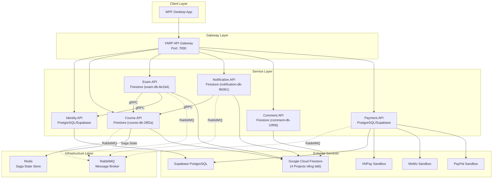
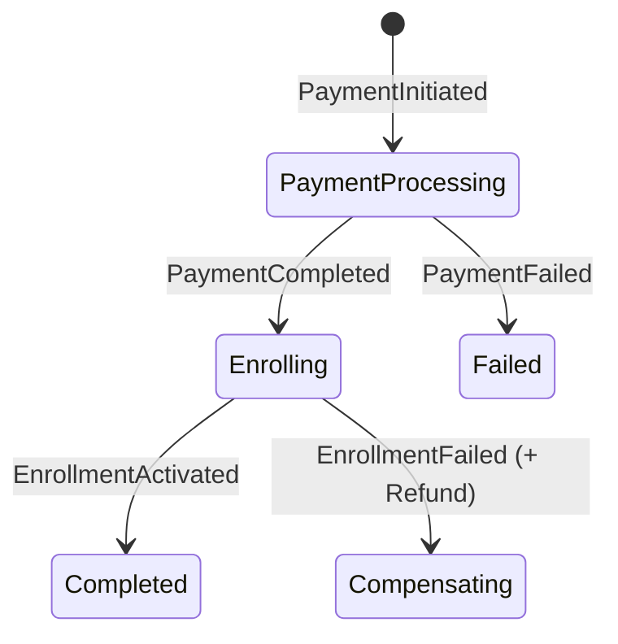
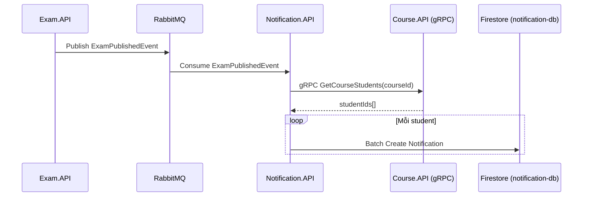
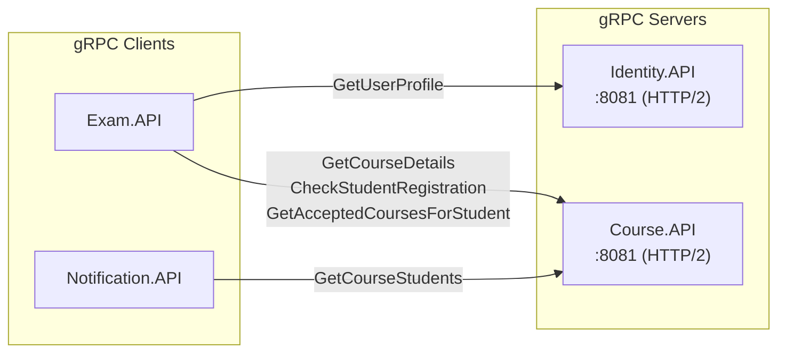
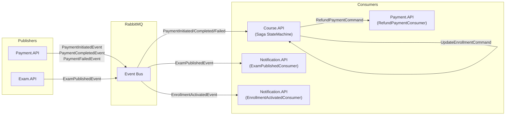
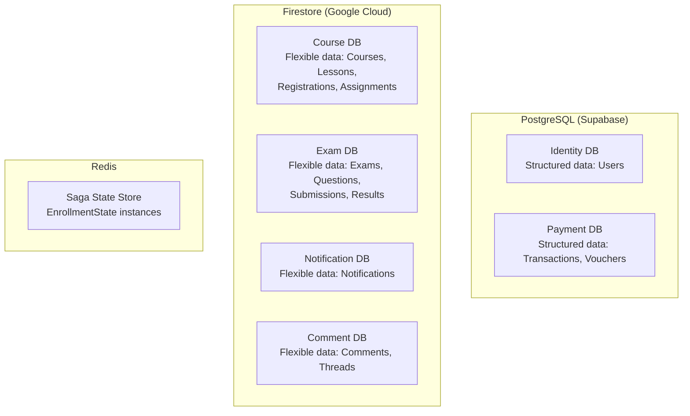
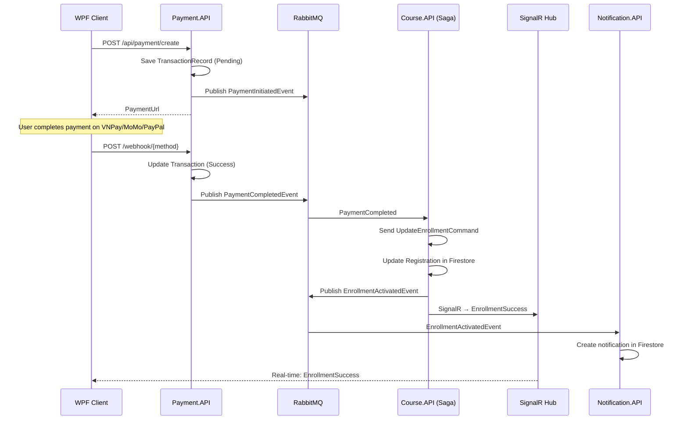
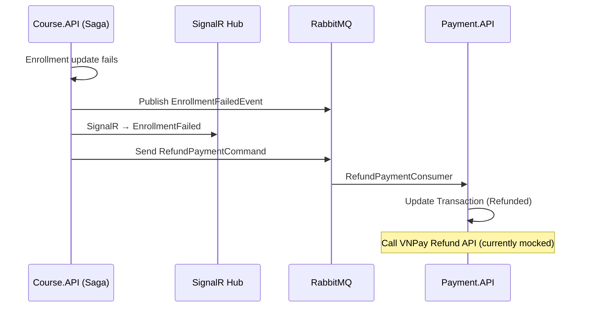
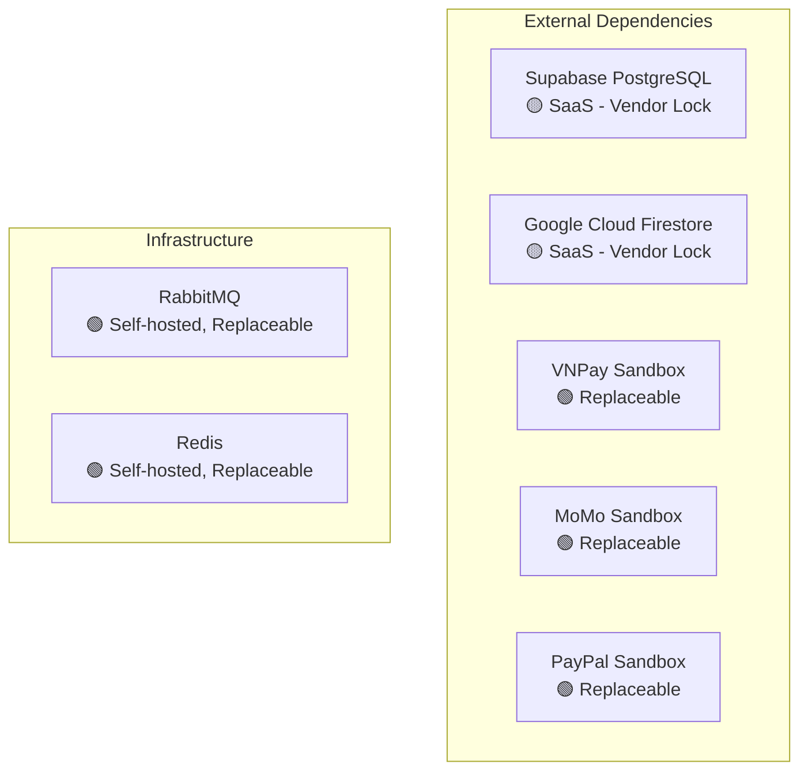

# BÁO CÁO KỸ THUẬT BACKEND CHUYÊN SÂU
## Hệ thống SmartEdu — Microservices Architecture
### Dự án SE361_Microservices

---

**Tác giả đánh giá**: AI Principal Software Architect  
**Ngày đánh giá**: 25/06/2026  
**Phiên bản báo cáo**: 1.0  
**Phạm vi**: Toàn bộ Backend (6 Microservices + API Gateway + Infrastructure)

---

## MỤC LỤC

1. [Tổng quan Kiến trúc Hệ thống](#1-tổng-quan-kiến-trúc-hệ-thống)
2. [Phân tích Chi tiết từng Microservice](#2-phân-tích-chi-tiết-từng-microservice)
3. [Giao tiếp Liên dịch vụ (Inter-Service Communication)](#3-giao-tiếp-liên-dịch-vụ)
4. [Quản lý Dữ liệu & Database Pattern](#4-quản-lý-dữ-liệu--database-pattern)
5. [Saga Pattern & Distributed Transactions](#5-saga-pattern--distributed-transactions)
6. [Bảo mật & Xác thực (Security & Authentication)](#6-bảo-mật--xác-thực)
7. [Xử lý Lỗi & Observability](#7-xử-lý-lỗi--observability)
8. [API Gateway & Routing](#8-api-gateway--routing)
9. [Health Checks & Reliability](#9-health-checks--reliability)
10. [Containerization & Deployment](#10-containerization--deployment)
11. [Đánh giá Design Patterns & Architecture Principles](#11-đánh-giá-design-patterns--architecture-principles)
12. [Phân tích Rủi ro & Nợ Kỹ thuật (Technical Debt)](#12-phân-tích-rủi-ro--nợ-kỹ-thuật)
13. [Đề xuất Cải tiến (Recommendations)](#13-đề-xuất-cải-tiến)
14. [Ma trận Đánh giá Tổng hợp](#14-ma-trận-đánh-giá-tổng-hợp)

---

## 1. Tổng quan Kiến trúc Hệ thống

### 1.1. Kiến trúc Tổng thể

SmartEdu triển khai kiến trúc **Microservices** với 6 domain services, 1 API Gateway và 2 infrastructure services (RabbitMQ, Redis). Hệ thống sử dụng **ASP.NET Core 9.0** (.NET 9) làm runtime foundation, được containerize bằng Docker và orchestrate qua Docker Compose.



### 1.2. Technology Stack

| Layer | Công nghệ | Phiên bản | Vai trò |
|---|---|---|---|
| **Runtime** | .NET / ASP.NET Core | 9.0 | Application Framework |
| **API Gateway** | YARP (Yet Another Reverse Proxy) | Latest | Reverse Proxy & Load Balancing |
| **API Framework** | Carter + Minimal APIs | Latest | HTTP Endpoint Routing (5/6 services) |
| **API Framework** | MVC Controllers | Built-in | HTTP Endpoint Routing (Payment) |
| **CQRS** | MediatR | Latest | Command/Query Separation |
| **Validation** | FluentValidation | Latest | Request Validation Pipeline |
| **Message Broker** | RabbitMQ + MassTransit | 3-management-alpine | Async Communication |
| **gRPC** | Grpc.AspNetCore | Built-in | Sync Inter-service Communication |
| **Real-time** | SignalR | Built-in | WebSocket (Enrollment Hub) |
| **ORM** | Entity Framework Core + Npgsql | Latest | PostgreSQL Access |
| **NoSQL** | Google.Cloud.Firestore | Latest | Firestore Access |
| **Cache** | Redis + IMemoryCache | Alpine | Saga State + Transaction Cache |
| **Auth** | JWT Bearer Tokens | Built-in | Authentication |
| **Container** | Docker + Docker Compose | v3.4 | Deployment |

### 1.3. Đánh giá Kiến trúc Tổng thể

> [!TIP]
> **Điểm mạnh nổi bật**: Hệ thống đạt mức **Database-per-Service hoàn chỉnh** — mỗi service có database riêng biệt (4 Firestore project + 2 Supabase PostgreSQL instances). Đây là best practice khó đạt được trong thực tế.

> [!WARNING]
> **Điểm cần lưu ý**: Hệ thống **polyglot persistence** (PostgreSQL + Firestore) tạo ra sự phức tạp trong operational management. Mỗi Firestore project cần quản lý credentials riêng (`firebase_course.json`, `firebase_exam.json`, v.v.).

---

## 2. Phân tích Chi tiết từng Microservice

### 2.1. Identity Service

| Thuộc tính | Giá trị |
|---|---|
| **Database** | PostgreSQL (Supabase) — `aws-1-ap-northeast-2.pooler.supabase.com` |
| **Pattern** | CQRS (MediatR) + Carter Minimal API |
| **Auth** | JWT Bearer + BCrypt Password Hashing |
| **gRPC Server** | `UserProtoService` — expose `GetUserProfile` RPC |
| **Health Check** | PostgreSQL connectivity |

**Chức năng chính:**
- Đăng ký tài khoản (Email/Password)
- Đăng nhập Email + Google OAuth
- Quên mật khẩu
- Quản lý User Profile
- Expose gRPC service cho các service khác truy vấn thông tin user

**Phân tích Source Code:**

[Program.cs](file:///c:/Users/dinhq/source/repos/SE361_Microservices/Services/Identity/Identity.API/Program.cs) cho thấy Identity service là service duy nhất sử dụng **Entity Framework Core** với PostgreSQL:

```csharp
builder.Services.AddDbContext<IdentityDbContext>(options =>
    options.UseNpgsql(builder.Configuration.GetConnectionString("DefaultConnection")));
```

[User.cs](file:///c:/Users/dinhq/source/repos/SE361_Microservices/Services/Identity/Identity.API/Models/User.cs) — Domain model với các trường: `Id`, `Email`, `PasswordHash`, `FullName`, `Role`, `PhoneNumber`, `CreatedAt`, `IsBlocked`, `ProfileImageUrl`. Sử dụng Data Annotations cho mapping.

[UserGrpcService.cs](file:///c:/Users/dinhq/source/repos/SE361_Microservices/Services/Identity/Identity.API/Services/UserGrpcService.cs) — gRPC service cho phép Exam.API truy vấn thông tin user mà không cần truy cập trực tiếp database.

**Đánh giá chuyên sâu:**

| Tiêu chí | Đánh giá | Ghi chú |
|---|---|---|
| Data Isolation | ✅ Tốt | Database riêng, expose qua gRPC |
| Migration Strategy | ✅ Tốt | Auto-migrate on startup |
| Password Security | ✅ Tốt | BCrypt hashing |
| JWT Implementation | ⚠️ Cần cải thiện | Hardcoded fallback key |
| Auth Provider | ⚠️ Cần cải thiện | Không dùng Identity framework chuẩn |

> [!CAUTION]
> **Rủi ro bảo mật**: JWT secret key có fallback hardcoded: `"super_secret_key_smartedu_1234567890"`. Trong production, nếu configuration thiếu, key yếu này sẽ được sử dụng.

---

### 2.2. Course Service

| Thuộc tính | Giá trị |
|---|---|
| **Database** | Google Cloud Firestore — Project `course-db-28f2a` |
| **Pattern** | CQRS (MediatR) + Carter Minimal API + Saga Pattern |
| **Message Broker** | RabbitMQ (Producer + Consumer + Saga) |
| **gRPC Server** | `CourseProtoService` — 4 RPCs |
| **Real-time** | SignalR `EnrollmentHub` |
| **Cache** | Redis (Saga State Store) |
| **Health Check** | Firestore + Redis connectivity |

**Chức năng chính:**
- CRUD Courses, Lessons, Contents, Assignments
- Enrollment/Registration workflow (Saga-based)
- Quản lý sinh viên theo khóa học
- Real-time enrollment notifications via SignalR

**gRPC API Surface** ([course.proto](file:///c:/Users/dinhq/source/repos/SE361_Microservices/Services/Course/Course.API/Protos/course.proto)):
- `GetCourseDetails` — Truy vấn thông tin khóa học
- `CheckStudentRegistration` — Kiểm tra trạng thái đăng ký
- `GetAcceptedCoursesForStudent` — Danh sách khóa học đã đăng ký
- `GetCourseStudents` — Danh sách sinh viên trong khóa học

**Saga State Machine** ([EnrollmentStateMachine.cs](file:///c:/Users/dinhq/source/repos/SE361_Microservices/Services/Course/Course.API/Features/Registrations/Sagas/EnrollmentStateMachine.cs)):



**Đánh giá chuyên sâu:**

| Tiêu chí | Đánh giá | Ghi chú |
|---|---|---|
| Saga Implementation | ✅ Tốt | MassTransit StateMachine + Redis persistence |
| gRPC API | ✅ Tốt | Rich API surface (4 RPCs) |
| Real-time | ✅ Tốt | SignalR cho enrollment feedback |
| Feature Organization | ✅ Tốt | Feature-based folder structure |
| Data Isolation | ✅ Tốt | Firestore project riêng |

> [!IMPORTANT]
> Course.API là **service phức tạp nhất** trong hệ thống — đảm nhận vai trò Saga Orchestrator, gRPC Server, SignalR Hub, và Firestore CRUD. Đây là core domain service.

---

### 2.3. Exam Service

| Thuộc tính | Giá trị |
|---|---|
| **Database** | Google Cloud Firestore — Project `exam-db-8e1b4` |
| **Pattern** | Clean Architecture (4-layer) + CQRS |
| **gRPC Client** | Consume `CourseProtoService` + `UserProtoService` |
| **Message Broker** | RabbitMQ (Producer) |
| **Health Check** | Firestore connectivity |

**Chức năng chính:**
- Tạo và quản lý đề thi
- Tổ chức thi trực tuyến
- Chấm điểm tự động
- Publish `ExamPublishedEvent` khi đề thi được công bố

**Kiến trúc Clean Architecture:**

```
Exam/
├── Exam.API/           → Presentation Layer (Carter Endpoints, Program.cs)
├── Exam.Application/   → Application Layer (Use Cases, DTOs, Interfaces)
├── Exam.Domain/        → Domain Layer (Entities, Models)
└── Exam.Infrastructure/→ Infrastructure Layer (Repository, gRPC Clients)
```

**Đánh giá chuyên sâu:**

| Tiêu chí | Đánh giá | Ghi chú |
|---|---|---|
| Architecture | ✅ Xuất sắc | Duy nhất service triển khai Clean Architecture đầy đủ |
| Dependency Inversion | ✅ Tốt | Interface-based repository pattern |
| gRPC Integration | ✅ Tốt | 2 gRPC clients (Course + Identity) |
| Data Isolation | ✅ Tốt | Firestore project riêng |

> [!TIP]
> **Điểm nổi bật**: Exam.API là service **duy nhất** triển khai đầy đủ **Clean Architecture** (4 layers). Các service khác dùng flat/feature-based structure. Đây là sự không nhất quán về kiến trúc, nhưng cũng cho thấy flexibility trong việc chọn architecture per-service.

---

### 2.4. Notification Service

| Thuộc tính | Giá trị |
|---|---|
| **Database** | Google Cloud Firestore — Project `notification-db-9b061` |
| **Pattern** | CQRS (MediatR) + Carter Minimal API |
| **gRPC Client** | Consume `CourseProtoService` |
| **Message Broker** | RabbitMQ (Consumer: `ExamPublishedConsumer`, `EnrollmentActivatedConsumer`) |
| **Health Check** | Firestore connectivity |

**Chức năng chính:**
- Nhận event `ExamPublishedEvent` → tạo notification cho toàn bộ sinh viên trong class (via gRPC `GetCourseStudents`)
- Nhận event `EnrollmentActivatedEvent` → tạo notification thanh toán thành công
- Gửi notification cho class (SendToClass endpoint)
- CRUD Notifications (GetNotifications, MarkAsRead)

**Luồng xử lý Event-Driven:**



**Đánh giá chuyên sâu:**

| Tiêu chí | Đánh giá | Ghi chú |
|---|---|---|
| Event-Driven | ✅ Tốt | 2 consumers xử lý async events |
| Data Isolation | ✅ Tốt | Firestore project riêng (sau refactoring) |
| gRPC Usage | ✅ Tốt | Dùng gRPC thay vì truy cập trực tiếp Course DB |
| Batch Operations | ✅ Tốt | Firestore batch write cho hiệu suất |

> [!NOTE]
> Notification.API đã được **refactor** trong session trước để loại bỏ vi phạm Database-per-Service pattern. Trước đây service này truy cập trực tiếp collection `courseRegistrations` trong Firestore của Course. Hiện tại, nó sử dụng **gRPC client** để query Course.API.

---

### 2.5. Comment Service

| Thuộc tính | Giá trị |
|---|---|
| **Database** | Google Cloud Firestore — Project `comment-db-10f06` |
| **Pattern** | CQRS (MediatR) + Carter Minimal API |
| **Message Broker** | ❌ Không sử dụng |
| **Health Check** | Firestore connectivity |

**Chức năng chính:**
- CRUD Comments cho lessons/courses
- Standalone service, không có inter-service communication qua event bus

**Đánh giá chuyên sâu:**

| Tiêu chí | Đánh giá | Ghi chú |
|---|---|---|
| Simplicity | ✅ Tốt | Service đơn giản, focused |
| Independence | ✅ Tốt | Không phụ thuộc service khác |
| Data Isolation | ✅ Tốt | Firestore project riêng |
| Feature Set | ⚠️ Hạn chế | Thiếu real-time comment updates |

---

### 2.6. Payment Service

| Thuộc tính | Giá trị |
|---|---|
| **Database** | PostgreSQL (Supabase) — `aws-1-ap-northeast-1.pooler.supabase.com` |
| **Pattern** | MVC Controllers (khác biệt so với 5 services còn lại) |
| **Message Broker** | RabbitMQ (Producer + Consumer: `RefundPaymentConsumer`) |
| **Cache** | IMemoryCache (transaction correlation mapping) |
| **Health Check** | PostgreSQL connectivity |

**Chức năng chính:**
- Tạo payment URL (VNPay, MoMo, PayPal)
- Xử lý webhook callbacks
- Publish events: `PaymentInitiatedEvent`, `PaymentCompletedEvent`, `PaymentFailedEvent`
- Consume: `RefundPaymentCommand` (compensating transaction)
- Quản lý vouchers và transaction records

**Payment Gateway Integration:**

| Gateway | Trạng thái | Implementation |
|---|---|---|
| **VNPay** | ✅ Sandbox | [VnPayService.cs](file:///c:/Users/dinhq/source/repos/SE361_Microservices/Services/Payment/Payment.API/Services/VnPayService.cs) |
| **MoMo** | ✅ Sandbox | [MoMoService.cs](file:///c:/Users/dinhq/source/repos/SE361_Microservices/Services/Payment/Payment.API/Services/MoMoService.cs) |
| **PayPal** | ✅ Sandbox | [PayPalService.cs](file:///c:/Users/dinhq/source/repos/SE361_Microservices/Services/Payment/Payment.API/Services/PayPalService.cs) |

**Đánh giá chuyên sâu:**

| Tiêu chí | Đánh giá | Ghi chú |
|---|---|---|
| Multi-gateway | ✅ Tốt | 3 payment providers |
| Saga Participant | ✅ Tốt | Publish/Consume events đúng flow |
| Architecture | ⚠️ Inconsistent | Dùng MVC Controllers thay vì Carter/MediatR |
| Voucher System | ✅ Tốt | Database-backed với seed data |
| Transaction Cache | ⚠️ Rủi ro | IMemoryCache mất dữ liệu khi restart |
| Auth | ❌ Thiếu | Không có JWT Authentication |

> [!WARNING]
> **Rủi ro nghiêm trọng**: Payment.API **không triển khai JWT Authentication** — không có `AddAuthentication()` hay `UseAuthentication()` trong pipeline. Bất kỳ ai có access đến API endpoint đều có thể tạo payment hoặc gọi webhook. Trong môi trường production, đây là lỗ hổng bảo mật cấp **Critical**.

> [!CAUTION]
> **IMemoryCache Risk**: Mapping `txnRef → correlationId` lưu trong IMemoryCache. Nếu container restart giữa lúc user đang thanh toán, callback từ VNPay/MoMo sẽ không tìm được `correlationId`, dẫn đến tạo `correlationId` mới và **mất liên kết** với Saga state. Cần chuyển sang **Redis** hoặc **Database-backed** cache.

---

## 3. Giao tiếp Liên dịch vụ

### 3.1. Tổng quan Communication Patterns

| Pattern | Sử dụng | Giữa các services |
|---|---|---|
| **Synchronous gRPC** | Truy vấn dữ liệu real-time | Exam→Course, Exam→Identity, Notification→Course |
| **Async Events (Pub/Sub)** | Domain events | Payment→Course, Course→Notification, Exam→Notification |
| **Async Commands (Send)** | Saga commands | Course Saga→Course (UpdateEnrollment), Course Saga→Payment (RefundPayment) |
| **SignalR WebSocket** | Real-time push | Course.API→WPF Client (Enrollment status) |

### 3.2. gRPC Communication Map



**Proto Definitions:**
- [user.proto](file:///c:/Users/dinhq/source/repos/SE361_Microservices/Services/Identity/Identity.API/Protos/user.proto) — 1 RPC: `GetUserProfile`
- [course.proto](file:///c:/Users/dinhq/source/repos/SE361_Microservices/Services/Course/Course.API/Protos/course.proto) — 4 RPCs: `GetCourseDetails`, `CheckStudentRegistration`, `GetAcceptedCoursesForStudent`, `GetCourseStudents`

### 3.3. Event Bus Communication Map



### 3.4. Integration Events Catalog

| Event | Source | Consumer(s) | Payload |
|---|---|---|---|
| `PaymentInitiatedEvent` | Payment.API | Course Saga | `CorrelationId`, `UserId`, `CourseId`, `Amount` |
| `PaymentCompletedEvent` | Payment.API | Course Saga | `CorrelationId`, `TransactionId` |
| `PaymentFailedEvent` | Payment.API | Course Saga | `CorrelationId`, `Reason` |
| `EnrollmentActivatedEvent` | Course Saga | Notification.API | `CorrelationId`, `UserId`, `CourseId` |
| `EnrollmentFailedEvent` | Course Saga | (Internal Saga) | `CorrelationId`, `Reason` |
| `ExamPublishedEvent` | Exam.API | Notification.API | `ExamId`, `Title`, `CourseId`, `SenderId`, `SenderName` |
| `UpdateEnrollmentCommand` | Course Saga | Course.API | `CorrelationId`, `UserId`, `CourseId`, `TransactionId`, `Amount` |
| `RefundPaymentCommand` | Course Saga | Payment.API | `CorrelationId`, `TransactionId`, `Reason` |

**Đánh giá:**

> [!TIP]
> **Sử dụng MassTransit KebabCase endpoint formatter** — đảm bảo tên queue nhất quán và dễ debug. Configuration centralized trong [Extensions.cs](file:///c:/Users/dinhq/source/repos/SE361_Microservices/BuildingBlocks/BuildingBlocks.Messaging/MassTransit/Extensions.cs).

> [!WARNING]
> **IntegrationEvent base record** ([IntegrationEvent.cs](file:///c:/Users/dinhq/source/repos/SE361_Microservices/BuildingBlocks/BuildingBlocks.Messaging/Events/IntegrationEvent.cs)) có vấn đề: `Id => Guid.NewGuid()` — mỗi lần access property `Id` sẽ tạo GUID mới. Đây là **bug** — cần đổi thành `public Guid Id { get; init; } = Guid.NewGuid();`.

---

## 4. Quản lý Dữ liệu & Database Pattern

### 4.1. Database-per-Service Compliance

| Service | Database | Project/Instance | Isolation Level |
|---|---|---|---|
| **Identity.API** | PostgreSQL (Supabase) | `haincorzywjystwbuomf` | ✅ **Full Isolation** |
| **Course.API** | Firestore | `course-db-28f2a` | ✅ **Full Isolation** |
| **Exam.API** | Firestore | `exam-db-8e1b4` | ✅ **Full Isolation** |
| **Notification.API** | Firestore | `notification-db-9b061` | ✅ **Full Isolation** |
| **Comment.API** | Firestore | `comment-db-10f06` | ✅ **Full Isolation** |
| **Payment.API** | PostgreSQL (Supabase) | `cgemkhxgwzdwvrwmonvr` | ✅ **Full Isolation** |

> [!TIP]
> **100% Database-per-Service compliance** — Mỗi service có database/project riêng biệt. Không có service nào truy cập trực tiếp database của service khác. Đây là kết quả của quá trình refactoring trong session trước.

### 4.2. Polyglot Persistence Strategy



**Phân tích quyết định:**
- **PostgreSQL cho Identity & Payment**: Đúng quyết định — dữ liệu quan hệ có schema rõ ràng (users với unique email, transactions với voucher references), cần ACID transactions.
- **Firestore cho Course/Exam/Notification/Comment**: Hợp lý cho dữ liệu semi-structured, nested (bài giảng chứa nội dung, đề thi chứa câu hỏi), không cần complex JOINs.
- **Redis cho Saga State**: Best practice — fast read/write cho state machine transitions.

### 4.3. Data Access Patterns

| Service | ORM/SDK | Pattern |
|---|---|---|
| Identity.API | Entity Framework Core + Npgsql | Repository via DbContext |
| Payment.API | Entity Framework Core + Npgsql | Direct DbContext injection |
| Course.API | Google.Cloud.Firestore SDK | Direct Firestore SDK calls |
| Exam.API | Google.Cloud.Firestore SDK | **Repository Pattern** (IExamRepository → ExamRepository) |
| Notification.API | Google.Cloud.Firestore SDK | Direct Firestore SDK calls |
| Comment.API | Google.Cloud.Firestore SDK | Direct Firestore SDK calls |

> [!NOTE]
> Chỉ Exam.API triển khai **Repository Pattern** đầy đủ với interface `IExamRepository`. Các service Firestore khác inject `FirestoreDb` trực tiếp vào handlers, tạo coupling chặt giữa business logic và infrastructure.

---

## 5. Saga Pattern & Distributed Transactions

### 5.1. Enrollment Saga — Choreography + Orchestration Hybrid

Hệ thống sử dụng **MassTransit StateMachine** — một dạng **Orchestration-based Saga** trong đó Course.API đóng vai trò Saga Orchestrator.

**Saga Flow hoàn chỉnh:**



**Compensating Transaction (Happy Path Failure):**



### 5.2. Saga State Persistence

[EnrollmentState.cs](file:///c:/Users/dinhq/source/repos/SE361_Microservices/Services/Course/Course.API/Features/Registrations/Sagas/EnrollmentState.cs) được persist trong **Redis** qua MassTransit Redis Repository:

```csharp
config.AddSagaStateMachine<EnrollmentStateMachine, EnrollmentState>()
    .RedisRepository(r => {
        r.DatabaseConfiguration(builder.Configuration["Redis:ConnectionString"]);
    });
```

**Đánh giá Saga Implementation:**

| Tiêu chí | Đánh giá | Chi tiết |
|---|---|---|
| State Persistence | ✅ Tốt | Redis — fast & durable |
| Compensation | ✅ Tốt | RefundPaymentCommand on failure |
| Real-time Feedback | ✅ Xuất sắc | SignalR direct from Saga |
| Idempotency | ⚠️ Thiếu | Không có idempotency key checking |
| Timeout Handling | ⚠️ Thiếu | Không có saga timeout/expiry |
| Observability | ⚠️ Cơ bản | Chỉ có logging, thiếu distributed tracing |

> [!WARNING]
> **Thiếu Saga Timeout**: Nếu `PaymentCompletedEvent` không bao giờ đến (VNPay timeout, user abandon), Saga sẽ ở trạng thái `PaymentProcessing` **vĩnh viễn**. Cần thêm `Schedule` + `TimeoutExpired` event trong MassTransit.

---

## 6. Bảo mật & Xác thực

### 6.1. JWT Authentication Architecture

**Services có JWT:**
- ✅ Identity.API, Course.API, Exam.API, Notification.API, Comment.API

**Services THIẾU JWT:**
- ❌ **Payment.API** — Không có authentication middleware
- ⚠️ **YarpApiGateway** — Proxy pass-through, không verify token

**JWT Configuration (5 services):**

```csharp
// Cùng configuration pattern trong tất cả 5 services
var jwtkey = builder.Configuration["Jwt:Key"] ?? "super_secret_key_smartedu_1234567890";
builder.Services.AddAuthentication(JwtBearerDefaults.AuthenticationScheme)
    .AddJwtBearer(options => {
        options.TokenValidationParameters = new TokenValidationParameters {
            ValidateIssuer = true,
            ValidateAudience = true,
            ValidateLifetime = true,
            ValidateIssuerSigningKey = true,
            ValidIssuer = "SmartEdu" / "EduSmartAPI",  // Inconsistent!
            ValidAudience = "SmartEduClient" / "EduSmartWPF",  // Inconsistent!
            IssuerSigningKey = new SymmetricSecurityKey(...)
        };
    });
```

### 6.2. Phân tích Rủi ro Bảo mật

| Rủi ro | Mức độ | Mô tả |
|---|---|---|
| **Payment API không auth** | 🔴 Critical | Bất kỳ ai đều có thể tạo payment hoặc fake webhook |
| **JWT key hardcoded fallback** | 🔴 Critical | Key yếu `super_secret_key_smartedu_1234567890` làm fallback |
| **Issuer/Audience mismatch** | 🟡 Medium | Identity dùng `EduSmartAPI/EduSmartWPF`, các service khác dùng `SmartEdu/SmartEduClient` |
| **Credentials in source code** | 🔴 Critical | Supabase password, Firebase API key, VNPay secret, PayPal credentials đều hardcoded trong `appsettings.json` |
| **Webhook không verify signature** | 🟡 Medium | VNPay webhook không verify HMAC signature |
| **No rate limiting** | 🟡 Medium | Không có rate limiting ở Gateway hoặc service level |
| **No CORS configuration** | 🟡 Medium | Không có CORS policy (chấp nhận được cho WPF client) |

> [!CAUTION]
> **Credentials Exposure**: Toàn bộ production credentials (Supabase connection strings, Firebase API keys, VNPay HashSecret, PayPal Secret) đều nằm trong `appsettings.json` và được commit vào source control. Đây là **vi phạm bảo mật nghiêm trọng** — cần chuyển sang Environment Variables hoặc Secret Manager.

---

## 7. Xử lý Lỗi & Observability

### 7.1. Exception Handling Pipeline

Hệ thống sử dụng **Global Exception Handler** pattern thông qua [CustomExceptionHandler.cs](file:///c:/Users/dinhq/source/repos/SE361_Microservices/BuildingBlocks/BuildingBlocks/Exceptions/Handler/CustomExceptionHandler.cs):

```
Exception → CustomExceptionHandler → ProblemDetails Response
├── InternalServerException → 500
├── ValidationException → 400 (+ ValidationErrors)
├── BadRequestException → 400
├── NotFoundException → 404
└── _ (Unknown) → 500
```

**Custom Exception Types:**
- [BadRequestException](file:///c:/Users/dinhq/source/repos/SE361_Microservices/BuildingBlocks/BuildingBlocks/Exceptions/BadRequestException.cs)
- [NotFoundException](file:///c:/Users/dinhq/source/repos/SE361_Microservices/BuildingBlocks/BuildingBlocks/Exceptions/NotFoundException.cs)
- [InternalServerException](file:///c:/Users/dinhq/source/repos/SE361_Microservices/BuildingBlocks/BuildingBlocks/Exceptions/InternalServerException.cs)

**Đánh giá:**
- ✅ Sử dụng RFC 7807 ProblemDetails standard
- ✅ Include `traceId` cho correlation
- ✅ Centralized trong BuildingBlocks (DRY)
- ⚠️ Không mask sensitive information trong error messages
- ❌ Payment.API không sử dụng pattern này (dùng MVC exception handling)

### 7.2. Logging & MediatR Pipeline

[LoggingBehavior.cs](file:///c:/Users/dinhq/source/repos/SE361_Microservices/BuildingBlocks/BuildingBlocks/Behaviors/LoggingBehavior.cs) — MediatR pipeline behavior:

```
Request → [LoggingBehavior] → [ValidationBehavior] → Handler → Response
           ↓                    ↓
        Log START/END      FluentValidation
        + Performance      (throws if invalid)
        Warning (>3s)
```

| Tiêu chí | Đánh giá | Chi tiết |
|---|---|---|
| Structured Logging | ✅ Tốt | Sử dụng ILogger với structured parameters |
| Performance Monitoring | ✅ Tốt | Warning log cho requests > 3 giây |
| Request Validation | ✅ Tốt | FluentValidation pipeline |
| Distributed Tracing | ❌ Thiếu | Không có OpenTelemetry/Jaeger integration |
| Centralized Logging | ❌ Thiếu | Không có ELK/Seq/Application Insights |
| Metrics | ❌ Thiếu | Không có Prometheus/Grafana |

---

## 8. API Gateway & Routing

### 8.1. YARP Configuration

[Gateway Program.cs](file:///c:/Users/dinhq/source/repos/SE361_Microservices/ApiGateways/YarpApiGateway/Program.cs) — Lightweight reverse proxy:

```csharp
builder.Services.AddReverseProxy()
    .LoadFromConfig(builder.Configuration.GetSection("ReverseProxy"));
app.UseWebSockets();   // Support SignalR
app.MapHealthChecks("/health");
app.MapReverseProxy();
```

### 8.2. Routing Table

| Route Pattern | Cluster | Backend URL |
|---|---|---|
| `/api/auth/{**catch-all}` | identity-cluster | `http://identity.api:8080` |
| `/api/users/{**catch-all}` | identity-cluster | `http://identity.api:8080` |
| `/api/courses/{**catch-all}` | course-cluster | `http://course.api:8080` |
| `/api/exams/{**catch-all}` | exam-cluster | `http://exam.api:8080` |
| `/api/notifications/{**catch-all}` | notification-cluster | `http://notification.api:8080` |
| `/api/comments/{**catch-all}` | comment-cluster | `http://comment.api:8080` |
| `/api/payment/{**catch-all}` | payment-cluster | `http://payment.api:8080` |
| `/course-api/hubs/{**catch-all}` | course-cluster | Path Transform → `/hubs/{**catch-all}` |

**Đánh giá Gateway:**

| Tiêu chí | Đánh giá | Chi tiết |
|---|---|---|
| Routing | ✅ Tốt | Clean, RESTful route patterns |
| WebSocket Support | ✅ Tốt | SignalR proxy với path transform |
| Health Check | ✅ Tốt | `/health` endpoint |
| Load Balancing | ⚠️ Đơn giản | 1 destination per cluster (no LB) |
| Rate Limiting | ❌ Thiếu | Không có rate limiting |
| Auth at Gateway | ❌ Thiếu | Không validate JWT tại gateway level |
| Circuit Breaker | ❌ Thiếu | Không có circuit breaker pattern |
| Request Logging | ❌ Thiếu | Không log incoming requests |

---

## 9. Health Checks & Reliability

### 9.1. Health Check Matrix

| Service | Endpoint | Checks | Dependencies Monitored |
|---|---|---|---|
| **Gateway** | `/health` | Basic | ✅ Self-check |
| **Identity.API** | `/health` | PostgreSQL | ✅ Supabase DB connectivity |
| **Course.API** | `/health` | Redis + Firestore | ✅ Redis + Firestore connectivity |
| **Exam.API** | `/health` | Firestore | ✅ Firestore connectivity |
| **Notification.API** | `/health` | Firestore | ✅ Firestore connectivity |
| **Comment.API** | `/health` | Firestore | ✅ Firestore connectivity |
| **Payment.API** | `/health` | PostgreSQL | ✅ Supabase DB connectivity |

### 9.2. Docker Health Checks

Tất cả services trong `docker-compose.yml` đều có health check:
```yaml
healthcheck:
  test: ["CMD", "curl", "-f", "http://localhost:8080/health"]
  interval: 30s
  timeout: 10s
  retries: 3
```

**Custom Firestore Health Check** ([FirestoreHealthCheck.cs](file:///c:/Users/dinhq/source/repos/SE361_Microservices/BuildingBlocks/BuildingBlocks/HealthChecks/FirestoreHealthCheck.cs)):
- Query `_health_check/ping` document
- Timeout-aware via CancellationToken
- Returns `Healthy` or `Unhealthy` with exception details

**Đánh giá:**

| Tiêu chí | Đánh giá | Chi tiết |
|---|---|---|
| Coverage | ✅ Tốt | Tất cả services đều có health check |
| Dependency Checks | ✅ Tốt | Check actual database connectivity |
| Docker Integration | ✅ Tốt | `docker-compose` health checks configured |
| Custom Check | ✅ Tốt | Firestore health check tái sử dụng qua BuildingBlocks |
| RabbitMQ Check | ❌ Thiếu | Không monitor RabbitMQ connectivity |
| Readiness vs Liveness | ❌ Thiếu | Chỉ có 1 endpoint, không phân biệt |

---

## 10. Containerization & Deployment

### 10.1. Docker Architecture

**Dockerfile Pattern** (Multi-stage build):
```
Stage 1: mcr.microsoft.com/dotnet/aspnet:9.0 (runtime base)
Stage 2: mcr.microsoft.com/dotnet/sdk:9.0 (build)
Stage 3: publish (dotnet publish)
Stage 4: final (copy artifacts to runtime)
```

**Port Allocation:**

| Service | HTTP Port | gRPC Port | External Port |
|---|---|---|---|
| YarpApiGateway | 8080 | — | **7000** |
| Identity.API | 8080 | 8081 | — |
| Course.API | 8080 | 8081 | — |
| Exam.API | 8080 | — | — |
| Notification.API | 8080 | — | — |
| Comment.API | 8080 | — | — |
| Payment.API | 8080 | — | — |
| RabbitMQ | — | — | **5672**, **15672** |
| Redis | — | — | **6379** |

### 10.2. Volume Mounts & Secrets

```yaml
# Firebase credentials volume mount (6 services)
volumes:
  - ./firebase:/app/firebase
```

> [!WARNING]
> **Tất cả services** đều mount cùng thư mục `./firebase` — nhưng mỗi service chỉ đọc file JSON riêng (`firebase_course.json`, `firebase_exam.json`, v.v.). Trong production, nên sử dụng **Docker Secrets** hoặc **Kubernetes Secrets** thay vì file mount.

### 10.3. Đánh giá Docker Compose

| Tiêu chí | Đánh giá | Chi tiết |
|---|---|---|
| Multi-stage Build | ✅ Tốt | Optimize image size |
| .NET 9.0 | ✅ Tốt | Latest LTS runtime |
| Health Checks | ✅ Tốt | Configured for all services |
| depends_on | ⚠️ Basic | Chỉ check container start, không wait for healthy |
| Network Isolation | ❌ Thiếu | Tất cả service cùng default network |
| Resource Limits | ❌ Thiếu | Không có CPU/memory limits |
| Restart Policy | ❌ Thiếu | Không có restart policy |
| Logging Driver | ❌ Thiếu | Default stdout logging |

---

## 11. Đánh giá Design Patterns & Architecture Principles

### 11.1. Patterns Applied

| Pattern | Nơi áp dụng | Đánh giá |
|---|---|---|
| **CQRS** | 5/6 services (via MediatR) | ✅ Consistent (trừ Payment) |
| **Mediator** | 5/6 services (MediatR) | ✅ Good decoupling |
| **Saga (Orchestration)** | Course.API Enrollment | ✅ Well-implemented |
| **Database-per-Service** | 6/6 services | ✅ Full compliance |
| **API Gateway** | YARP | ✅ Clean routing |
| **Event-Driven** | Payment→Course→Notification | ✅ Loose coupling |
| **Repository** | Exam.API only | ⚠️ Inconsistent |
| **Clean Architecture** | Exam only (4-layer) | ⚠️ Inconsistent |
| **Shared Kernel** | BuildingBlocks | ✅ Good code reuse |

### 11.2. SOLID Principles Assessment

| Principle | Compliance | Evidence |
|---|---|---|
| **S** — Single Responsibility | ✅ Good | Mỗi service focus vào 1 bounded context |
| **O** — Open/Closed | ✅ Good | Pipeline behaviors extensible, Payment gateway via interface |
| **L** — Liskov Substitution | ✅ Good | `IPaymentGatewayService` → VnPay/MoMo/PayPal |
| **I** — Interface Segregation | ⚠️ Partial | Chỉ Exam có proper interfaces |
| **D** — Dependency Inversion | ⚠️ Partial | Exam tốt, các service khác inject concrete types |

### 11.3. 12-Factor App Assessment

| Factor | Compliance | Chi tiết |
|---|---|---|
| I. Codebase | ✅ | Mono-repo, Git-tracked |
| II. Dependencies | ✅ | NuGet, explicit declaration |
| III. Config | ⚠️ | Mix file + env vars, secrets in code |
| IV. Backing Services | ✅ | External services via connection strings |
| V. Build/Release/Run | ✅ | Docker multi-stage build |
| VI. Processes | ✅ | Stateless (trừ IMemoryCache trong Payment) |
| VII. Port Binding | ✅ | Kestrel self-hosting |
| VIII. Concurrency | ⚠️ | Single instance per service |
| IX. Disposability | ✅ | Fast startup, graceful shutdown |
| X. Dev/Prod Parity | ⚠️ | Dev và prod config khác nhau |
| XI. Logs | ⚠️ | Console output, no structured log aggregation |
| XII. Admin Processes | ❌ | Không có admin tools/scripts |

---

## 12. Phân tích Rủi ro & Nợ Kỹ thuật

### 12.1. Rủi ro theo Mức độ

#### 🔴 Critical (Cần xử lý ngay)

| # | Rủi ro | Service | Impact | Recommendation |
|---|---|---|---|---|
| C1 | Payment.API không có Authentication | Payment | Unauthorized access to payment endpoints | Thêm JWT middleware |
| C2 | Credentials hardcoded trong source | All | Secret exposure nếu repo bị leak | Sử dụng Docker Secrets/Vault |
| C3 | JWT key hardcoded fallback | All | Key yếu nếu config missing | Remove fallback, fail fast |
| C4 | IMemoryCache cho payment correlation | Payment | Mất data khi restart | Chuyển sang Redis |

#### 🟡 Medium (Cần xử lý trong sprint tiếp theo)

| # | Rủi ro | Service | Impact | Recommendation |
|---|---|---|---|---|
| M1 | Saga không có timeout | Course | Zombie saga instances | Thêm MassTransit Schedule |
| M2 | Webhook không verify signature | Payment | Fake payment callbacks | Implement HMAC verification |
| M3 | IntegrationEvent.Id tạo GUID mới mỗi lần access | BuildingBlocks | Duplicate event tracking fails | Đổi thành init-only property |
| M4 | Issuer/Audience JWT không nhất quán | Identity vs Others | Token validation mismatch | Standardize JWT config |
| M5 | Refund chỉ mock | Payment | Real refund không thực hiện | Implement actual refund APIs |

#### 🟢 Low (Technical Debt chấp nhận được)

| # | Rủi ro | Service | Impact | Recommendation |
|---|---|---|---|---|
| L1 | Kiến trúc không nhất quán giữa services | All | Complexity cho new developers | Document architecture decisions |
| L2 | Không có Distributed Tracing | All | Khó debug cross-service | Thêm OpenTelemetry |
| L3 | Thiếu unit/integration tests | All | Regression risk | Thêm test projects |
| L4 | Không có CI/CD pipeline | All | Manual deployment | Setup GitHub Actions |

### 12.2. Dependency Risk Matrix



---

## 13. Đề xuất Cải tiến

### 13.1. Short-term (1-2 Sprints)

| # | Đề xuất | Priority | Effort | Impact |
|---|---|---|---|---|
| 1 | Thêm JWT Authentication cho Payment.API | 🔴 Critical | Low | High |
| 2 | Move credentials sang Environment Variables | 🔴 Critical | Medium | High |
| 3 | Fix IntegrationEvent.Id bug | 🔴 Critical | Low | Medium |
| 4 | Chuyển IMemoryCache → Redis cho Payment correlation | 🟡 High | Medium | High |
| 5 | Thêm Saga Timeout (15 phút) | 🟡 High | Medium | Medium |
| 6 | Standardize JWT Issuer/Audience config | 🟡 High | Low | Medium |

### 13.2. Medium-term (3-5 Sprints)

| # | Đề xuất | Priority | Effort | Impact |
|---|---|---|---|---|
| 7 | Implement VNPay webhook signature verification | 🟡 Medium | Medium | High |
| 8 | Thêm Rate Limiting ở Gateway (YARP middleware) | 🟡 Medium | Medium | Medium |
| 9 | Setup OpenTelemetry + Jaeger cho Distributed Tracing | 🟡 Medium | High | High |
| 10 | Thêm RabbitMQ health check cho các service dùng MassTransit | 🟡 Medium | Low | Medium |
| 11 | Implement actual Refund API cho VNPay/MoMo/PayPal | 🟡 Medium | High | High |
| 12 | Thêm Network Isolation trong Docker Compose | 🟢 Low | Low | Medium |

### 13.3. Long-term (Architecture Evolution)

| # | Đề xuất | Priority | Effort | Impact |
|---|---|---|---|---|
| 13 | Setup CI/CD pipeline (GitHub Actions) | 🟡 Medium | Medium | High |
| 14 | Thêm Kubernetes deployment manifests | 🟢 Low | High | High |
| 15 | Implement Centralized Logging (ELK/Seq) | 🟢 Low | High | High |
| 16 | Add Prometheus metrics + Grafana dashboards | 🟢 Low | High | Medium |
| 17 | Standardize all services to Clean Architecture | 🟢 Low | High | Medium |
| 18 | Add comprehensive test suite (Unit + Integration) | 🟢 Low | High | High |

---

## 14. Ma trận Đánh giá Tổng hợp

### 14.1. Service Maturity Matrix

| Tiêu chí | Identity | Course | Exam | Notification | Comment | Payment |
|---|---|---|---|---|---|---|
| **Architecture** | ⭐⭐⭐ | ⭐⭐⭐ | ⭐⭐⭐⭐⭐ | ⭐⭐⭐ | ⭐⭐⭐ | ⭐⭐ |
| **Data Isolation** | ⭐⭐⭐⭐⭐ | ⭐⭐⭐⭐⭐ | ⭐⭐⭐⭐⭐ | ⭐⭐⭐⭐⭐ | ⭐⭐⭐⭐⭐ | ⭐⭐⭐⭐⭐ |
| **Security** | ⭐⭐⭐ | ⭐⭐⭐ | ⭐⭐⭐ | ⭐⭐⭐ | ⭐⭐⭐ | ⭐ |
| **Error Handling** | ⭐⭐⭐⭐ | ⭐⭐⭐⭐ | ⭐⭐⭐⭐ | ⭐⭐⭐⭐ | ⭐⭐⭐⭐ | ⭐⭐ |
| **Health Check** | ⭐⭐⭐⭐ | ⭐⭐⭐⭐⭐ | ⭐⭐⭐⭐ | ⭐⭐⭐⭐ | ⭐⭐⭐⭐ | ⭐⭐⭐⭐ |
| **Observability** | ⭐⭐ | ⭐⭐ | ⭐⭐ | ⭐⭐ | ⭐⭐ | ⭐⭐ |
| **Communication** | ⭐⭐⭐⭐ | ⭐⭐⭐⭐⭐ | ⭐⭐⭐⭐ | ⭐⭐⭐⭐ | ⭐⭐ | ⭐⭐⭐⭐ |

### 14.2. Tổng điểm theo Danh mục

| Danh mục | Điểm (1-10) | Nhận xét |
|---|---|---|
| **Kiến trúc Microservices** | **8/10** | Database-per-Service xuất sắc; cần consistency |
| **Inter-Service Communication** | **8.5/10** | gRPC + Event Bus + Saga — rất tốt |
| **Data Management** | **8/10** | Polyglot persistence hợp lý |
| **Security** | **4/10** | Payment không auth, credentials trong code |
| **Reliability** | **7/10** | Health checks tốt, thiếu circuit breaker |
| **Observability** | **4/10** | Chỉ có basic logging |
| **Deployment** | **7/10** | Docker containerized, thiếu CI/CD |
| **Code Quality** | **7/10** | CQRS pattern tốt, thiếu tests |
| **Scalability** | **6/10** | Single instance, no LB config |

### 14.3. Điểm Tổng hợp

| Metric | Score |
|---|---|
| **Architecture Maturity** | 🟢 **7.5/10** |
| **Production Readiness** | 🟡 **5.5/10** |
| **Security Posture** | 🔴 **4/10** |
| **Overall Technical Quality** | 🟡 **6.5/10** |

---

## KẾT LUẬN

Hệ thống SmartEdu Backend thể hiện một **kiến trúc microservices có tính phân tách cao** với nhiều điểm sáng đáng chú ý:

1. **Database-per-Service Pattern** được triển khai **100% compliance** — mỗi service có database/project riêng biệt
2. **Saga Pattern** cho enrollment workflow — orchestration-based với compensating transactions
3. **Multi-protocol communication** — gRPC (sync), RabbitMQ/MassTransit (async), SignalR (real-time)
4. **Shared BuildingBlocks** — code reuse hiệu quả cho cross-cutting concerns

Tuy nhiên, hệ thống cần cải thiện đáng kể về **bảo mật** (Payment auth, credentials management), **observability** (distributed tracing, centralized logging), và **operational maturity** (CI/CD, monitoring, testing) trước khi có thể coi là production-ready.

Ưu tiên hành động ngay: **Thêm JWT cho Payment.API** và **di chuyển credentials ra khỏi source code**.
